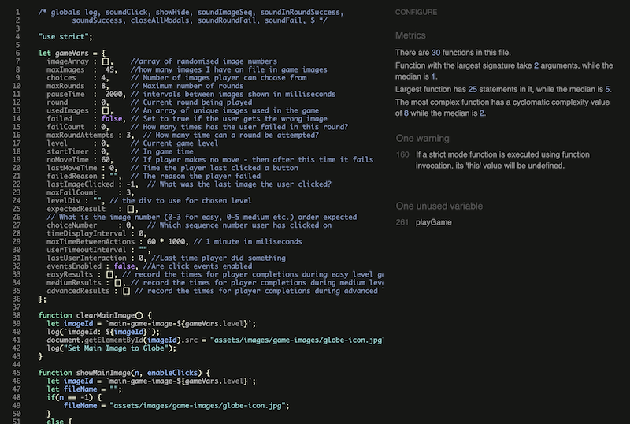
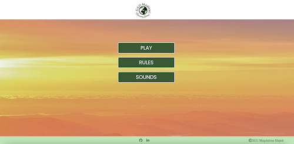
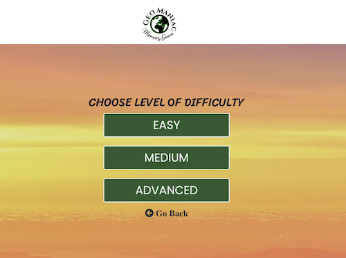

# ‘GeoManiac – Memory Game’

View the repository in GitHub [here](https://github.com/Madeline8/geomaniac-memory-game)

View the live project [here](https://madeline8.github.io/geomaniac-memory-game/)

## USER EXPERIENCE (UX)

**STRATEGY**

‘GEOMANIAC’ is an online game for all those who enjoy playing memory games as well as have interests in travelling and like to discover new places around the world. The aim of this game is to create a positive experience for a player so they enjoy the game, or they have a desire to visit new places shown in the game.

**USER STORIES**

Player’s goals

- As a player, I want to see a clearly structured page so I can    navigate around easily.
- As a player, I want to have fun while playing the game.
- As a player, I want to be able to learn about the rules of the game.
- As a player, I want to be able to challenge myself to a difficulty    level of my preference.
- As a player, I want to be able to turn the sounds on and off.
- As a player, I want to be able to adjust the volume of the sound /    music.
- As a player, I want to continuous feedback on how I am doing    throughout the game. I want to be in control.
- As a player, I want to see the time it takes me to complete the game.
- As a player want to be able to see who designed and developed the    game.

Website Developer’s / Business Goals

- As the website developer, I want anyone who enters this page to understand immediately what it offers.
- As the website developer, I want anyone who enters the page to see who created it and the year of creation.
- As the website developer, I want anyone who enters the page to be able to check out my GitHub or LinkedIn profiles.

**SCOPE**

This section explains in more detail what a user can expect, once they’ve accessed this web page. I have taken an agile approach and kept it simple. Any additional ideas are documented under ‘Features to implement’ section.

The main feature set that will add value and more importantly will allow user to navigate around easily and have fun using the website  are:

- Home page include 3 main buttons: Play, Rules, and Sounds.

- Play button: Once clicked, a player has a choice between easy, medium or advance game level. I used a bootstrap grid system for all game levels to make sure everything is aligned correctly and consistently. There is a ‘home return’ button if a player wants to return home while playing the game. It allows the player to keep the sound settings as they are, and not reset it to default. If a player clicks on the logo, it will also take them to a home page, however it will default all the settings.

- Rules button: Once clicked, the player will learn the rules of the game.

- Sounds button: Adjust the volume of music background and sound effects with an option to completely turn it off.

- Footer: a simple footer including name of the creator, year of creation, and links to LinkedIn and GitHub of the game creator.

**STRUCTURE**

Structure has been provided to the features and content. The relationship between the options above have been considered, so all options/navigation elements have been organised in terms of priority of content and the correct, predictable patterns, e.g: Once a player clicks on the ‘Play” button, they will be taken to the next modal that gives the player the option to choose a difficulty level. Another example is when a player completes one session of the game, they get notified and have a choice between selecting another game, or going to the main page/home.

**SKELETON**

Once the scope and structure have been defined, the next step is to define and explain how the information has ben implemented. This section includes the interface design and navigation design. This is best explained by providing wireframes that show how the page has been constructed and the features arranged.

[Balsamiq](https://balsamiq.com/) was the tool used in this project to finalise previously sketched wireframes. Below are low fidelity mock-ups.

[Desktop Wireframe](assets/images/wireframes/Desktop%20Wireframes.png)

[Mobile Wireframe](assets/images/wireframes/Mobile%20Wireframe.png)

[Tablet Wireframe](assets/images/wireframes/Tablet%20Wireframes.png)

Note: During the design stage, I decided to make some changes in order to provide a better user experience. 

**SURFACE**

The final product has been completed, with the goal to emphasise the meaning of the content throughout the page, navigate around the page in an intuitive way with a natural flow.

I went for a basic, and clear visual design. 

In terms of the colour scheme, one of the aims was to create positive emotions for the player, therefore the main colours on the page are in green and orange shades. Both colours relate to the topic of the game, which are the wonders of the world / geography. 

Orange colour created some warmth and comfort. It is a 'fun' colour. 

Green colour is affiliated with harmony, balance, or environmental awareness. 

## FEATURES

**Existing Features**

Features implemented in this game followed from the game logic, which you can read below. 

**Game Logic**
*The game consists of 3 levels: easy, medium and advanced.
Easy level:
Once a difficulty level is chosen and the player clicks the button to start a game, a sequence of images appears on the screen. Once it’s completed, the player gets notified that it is their turn to click in the right order on the images they have just seen. There are 8 rounds, with each round the sequence shows one additional image.

There are 4 images that the player needs to choose from.

After each round the player gets notified if they have successfully followed the pattern and needs to click in order to continue to the next round. The player wins if they successfully follow the right order in each round. Once all rounds have been completed, the player gets notified of how long it took to complete this level and has a choice to continue playing or going to the home screen. If the player chooses to continue playing, they get a pop up window to chose the level of difficulty.

The player can make two mistakes during each game. If the player fails to follow the sequence correctly, he gets notified and needs to repeat the same round again. If the player fails to follow a sequence for the second time during the game, he also gets notified and needs to repeat the failed round. Game ends with the third failed attempt to follow the correct sequence; the player gets notified and has a choice between playing again or going to the home screen.

Medium level: Same as above with the difference that there are 6 images for the player to choose from. Also, the player has less time to memorise each image than in the easy level.
Advanced level: Same as above with the difference that there are 8 images for the player to choose from. Also, the player has less time to memorise each image than in the medium level.*

**Features Still to Implement**
 - Create additional link where user can learn more about wonders of the
   world shown in game images.

 - Create a map of where the wonders are located.

 - Contact page: Contact the website developer with any query they might have.

 - More visual effects using jQuery

## **TECHNOLOGIES USED**

**Languages Used**

[HTML](https://en.wikipedia.org/wiki/HTML5)  -Mmarkup language used to structure and present content for my website.

 [CSS](https://en.wikipedia.org/wiki/CSS)  - to style all elements, also using different media queries. 

 [JavaScript](https://en.wikipedia.org/wiki/JavaScript)  - to create overall logic of the game as well as manage audio and all buttons/windows. 
 
 **Frameworks, Libraries and Programs used**

 [Am I Responsive?](http://ami.responsivedesign.is/)  - used to preview my site across a variety of devices.

[Autoprefixer](https://autoprefixer.github.io/)  - used to parse the CSS and to add vendor prefixes to CSS rules.

[Balsamiq](https://balsamiq.com/)  - used to create the wireframes.

[Bootstrap](https://getbootstrap.com/docs/4.6/getting-started/introduction/)  - to create flexible grids and ensure consistency across all windows.

[Canva](https://www.canva.com/)  - for logo design.

[Chrome Developer Tools](https://developers.google.com/web/tools/chrome-devtools)  - to check responsiveness of the page on different devices, as well as manage all logs and run tests when working with JavaScript.

[Font Awesome](https://fontawesome.com/)  - to improve a design; used return and home buttons

[Google Fonts](https://fonts.google.com/)  - used to provide the fonts 'Srirarcha' for the body ('Cursive and 
'Roboto as the second option), 'Poppins' for the buttons ('Roboto' as as a second option).

[Gitpod](https://gitpod.io/)  - used to develop the website.

[GitHub](https://github.com/)  - to store my repository and keep log of my commits 

[GitHub Pages](https://pages.github.com/)  - to deploy the website.

 [jQuery](https://jquery.com/)  - for additional effects. This is a JavaScript library.

 [StackEdit](https://stackedit.io/)  - used to write my README file.

[W3C Markup Validation Service](https://validator.w3.org/)  - to validate my HTML code.

[W3C CSS Validation Service](https://jigsaw.w3.org/css-validator)  - to validate my CSS file.

[jshint Validator](https://jshint.com/)  - to check and review all errors in Javascript code.

## TESTING

Please click [here](https://github.com/Madeline8/shake-up-milestone-one/blob/master/TESTING.md) to see the testing information.

**Code Validation**
I used [W3C Markup](https://validator.w3.org/) and [CSS Validation Service](https://jigsaw.w3.org/css-validator/) by coping the contents from my index.html and style.css file and pasting into ‘Validate by Direct Input’ field. There were no errors in the end:

I also used jshint validator to check for errors in JavaScript code. Final results below.

when running jshint there were some undefined variables but this is due to the fact I am using variables defined in one js file, in the other one. B looking at jshint documentation I worked out how to list variables defined in a different script, so it doesn't show me any warning about undefined variables. 
E.g. before I pasted in my code on to jshint, I included the following message on top of:
- On top of game.js file:

// The below is to list variables defined in a different script, when using jshint
/* globals log, soundClick, showHide, soundImageSeq, soundInRoundSuccess,
soundSuccess, closeAllModals, soundRoundFail, soundFail, $ */

- On top of script.js file:

// The below is to list variables defined in a different script, when using jshint
/* globals soundClick, setGameLevel, gameVars, playGame, soundManager, musicManager */

- On top of audio.js file:

// The below is to list variables defined in a different script, when using jshint
/* globals soundClick, setGameLevel, gameVars, playGame, soundManager, musicManager */

**User Stories**

Player’s goals
- As a player, I want to see a clearly structured page so I can navigate around easily. 
	- The main page contains all essential information clearly laid out. The first choice player needs to make is whether to play immediately, read the game rules, or set sounds; as per the screenshots below:

  

- As a player, I want to have fun while playing the game.

  This game was designed for memory game lovers.

- As a player, I want to be able to learn about the rules of the game.

	Player can access the game rules from the home page modal

  

- As a player, I want to be able to challenge myself to a difficulty level of my preference.
Player can choose between easy, medium and advance game level. With each level there are more images to choose from, as well as the playes has got less time to memorise each image shown.

  

- Player can turn the sounds as well as the music On or Off. 

  

- As a player, I want to be able to adjust the volume of the sound /    music.
Player can adjust the music and sounds volume. Screenshot above. 

- As a player, I want to continuous feedback on how I am doing  throughout the game. I want to be in control.

Player get continuous feedback after each move throughout the game. Player gets notified in the following situations:

Player, only once ready, can click the button and start the game. 

Player is notified when it's his turn to guess the correct sequence of images.
Player is notified once each round is correctly guessed.

Player is notified when he fails for the first as well as the second time.

Player is notified when he fails for the third time, and therefore fails the game.  

Player is notified that they have been inactive therefore the game is failed.

- As a player, I want to see the time it takes me to complete the game.
Player is notified how long it has taken to complete the game. 

- As a player want to be able to see who designed and developed the game.
Player can find the details in the footer section, available at all times. 

Website Developer’s / Business Goals
- As the website developer, I want anyone who enters this page to understand immediately what it offers.
Logo is clearly saying that 'Geomaniac' is a memory game. Rules are clearly explained. 

- As the website developer, I want anyone who enters the page to see who created it and the year of creation.
Visible in the footer. 

- As the website developer, I want anyone who enters the page to be able to check out my GitHub or LinkedIn profiles.
Visible in the footer.

**Browser Compatibility**
Site was tested across various browsers:

Everything has correctly rendered when it comes to the browsers below:

Google Chrome - OK

Safari - OK

Mozilla Firefox and Microsoft Edge it all worked ok however I noticed that the 'i-game'button' doesn't have the right height. I changed it to fit the content, but this still hasn;t fixed it. Due to lack of time I had to leave it. This is something I look look into in the future, as well as I would do the testing on more browsers. 

However, 

**Responsiveness / Device Compatibility**

I used Chrome Dev tools to check responsiveness across the following devices:

Galaxy S5

Pixel 2 

Pixel 2XL - all working correctly

iPhone 5/SE

iPhone 6/7/8 - all working correctly

iPhone 6/7/8 Plus - all working correctly

iPhone X - all working correctly

iPad - all working correctly

iPad Pro -all working correctly

Surface Duo - all working correctly

I had some issue with alignment on small devices i.e iPhone 5/SE and Samsun S5, however this has been fixed and I can confirm it's all working correctly. 

**Solved Bugs**
 - When displaying images in turn, the screen was not updating because the program was busy in a sleep loop. I needed to find a way to let other processes run so the screen gets updated when I’m waiting. 
Solution: I used [this](https://stackoverflow.com/questions/16623852/how-to-pause-javascript-code-execution-for-2-seconds) resource that helped me with a better understanding of the issue and finding a solution. I managed to refactor PlayGame function to use a time out methods instead of in-function pauses.
 - Using same Id’s in multiple divs: I realised that I had to differentiate between game levels, and I had to rename the divs for easy, medium and advanced game level, for instance: 
 for easy level: img-choice-0-0
 for medium level: img-choice-1-0
 for advanced level: img-choice-2-0

- When it’s the players turn to guess the images, if they clicked on a few images quickly, the system firstly allowed for this to happen, and secondly, two messages were shown on top of each other, depending on whether the player clicked on the correct or incorrect image. I tried disabling clicks in imageClicked and re-enabling them in showMainImage. I also tried using a gameVariable to show when click events were needed to be re-enabled. I realised the problems was that the click events were set to be enabled and in fact they had already been enabled, and this was causing the issue of the player being able to click multiple times, and multiple modals showing on top of each other. To solve this, after an image is clicked, I immediately disabled clicks on choice images, and then delayed enabling them until the main image choice started to be displayed again.

## DEPLOYMENT
**Github Pages**
This site has been directly deployed from the master branch (steps in the following link have been followed: [https://docs.github.com/en/pages/getting-started-with-github-pages/configuring-a-publishing-source-for-your-github-pages-site](https://docs.github.com/en/pages/getting-started-with-github-pages/configuring-a-publishing-source-for-your-github-pages-site)) and hosted using GitHub pages.

**Steps taken in order to deploy the page:**

1. Find the repository: [**https://github.com/Madeline8/geomaniac-memory-game**](https://github.com/Madeline8/geomaniac-memory-game)
2. On the repository page, go to “Settings”.
3. In the left hand side menu, go to “Pages”.
4. Decide whether to keep the repository public or set it as “private”.
5. Scroll down the page and find a notification under GitHub Pages “Pages settings now has its own dedicated tab! [Check it out here!](https://github.com/Madeline8/geomaniac-memory-game/settings/pages)”. Click on the link.
6. Under the source select the “main” branch and click “save”.
7. Notification received: “ Your site is ready to be published at [**https://madeline8.github.io/geomaniac-memory-game/**](https://madeline8.github.io/geomaniac-memory-game/)”. It might take up to 20 minutes for changes to be published.

**Forking the Github Repository**
It allows to make a copy of the original repository and make changes without having any effect on the original one. To fork the repository:
1.  Log into GitHub and find the [repository](https://github.com/Madeline8/geomaniac-memory-game)  you wish to fork.
2.  At the top-right of the repository underneath the navbar, click the "Fork" button.
3.  Copy of the original repository should be in your own Github account. 

**Making a Local Clone**
1.  Go to the main page of the repository on Github.
2.  Click 'Clone or download'.
3.  Clone with HTTPS, and copy the URL.
4.  Open terminal.
5.  Navigate to any location/directory of your choice.
6.  Type  `git clone`  and paste  [https://github.com/Madeline8/geomaniac-memory-game](https://github.com/Madeline8/geomaniac-memory-game).

More about the cloning process can be found in:  [https://docs.github.com/en/github/creating-cloning-and-archiving-repositories/cloning-a-repository](https://docs.github.com/en/github/creating-cloning-and-archiving-repositories/cloning-a-repository)
## CREDITS

[Create slider in sounds div](https://www.w3schools.com/howto/howto_js_rangeslider.asp): 
[Substring Method](https://www.w3schools.com/jsref/tryit.asp?filename=tryjsref_substring)

 - Background image was taken from
   [here](https://unsplash.com/photos/sDCG1hTV8mI):
   https://unsplash.com/photos/sDCG1hTV8mI
 - All image choices were taken from
   [here](https://www.listchallenges.com/100-wonders-of-the-world). 
   [https://www.listchallenges.com/100-wonders-of-the-world](https://www.listchallenges.com/100-wonders-of-the-world)
To design this logo I used [this](https://www.freelogodesign.org/) resource.      [**https://www.freelogodesign.org/**](https://www.freelogodesign.org/)
 - Content relating to colours was taken from [here](http://www.colour-affects.co.uk/psychological-properties-of-colours). 

Music and sound were taken from [here](https://freesound.org/).
Specifically, sound effects were taken from the following resources:

Clicks – sound of taking a photo with camera: [https://freesound.org/people/ArrowheadProductions/sounds/566366/](https://freesound.org/people/ArrowheadProductions/sounds/566366/)

 - Sound for successful round:      
   https://freesound.org/people/FunWithSound/sounds/456965/
 - Sound for       the end of successful game:      
   [https://freesound.org/people/Fupicat/sounds/521644/](https://freesound.org/people/Fupicat/sounds/521644/)
 - Sound for game over:      
   [https://freesound.org/people/Leszek_Szary/sounds/133283/](https://freesound.org/people/Leszek_Szary/sounds/133283/)
 - Fail sound during round of the game:      
   [https://freesound.org/people/themusicalnomad/sounds/253886/](https://freesound.org/people/themusicalnomad/sounds/253886/)
 - Sound for the main images when showing up:      
   [https://freesound.org/people/NoiseCollector/sounds/43025/](https://freesound.org/people/NoiseCollector/sounds/43025/)
 - Background music:      
Water-sound – background music taken from here:       [https://freemp3cloud.com/](https://freemp3cloud.com/)

## Acknowledgements

I would like to thank:
-   My mentor, Gerry McBride for his support.
-   Tutor support at Code Institute for their help on issues I encountered throughout the project.
-   My friend Antony, for spelling check across the website and mental support.

